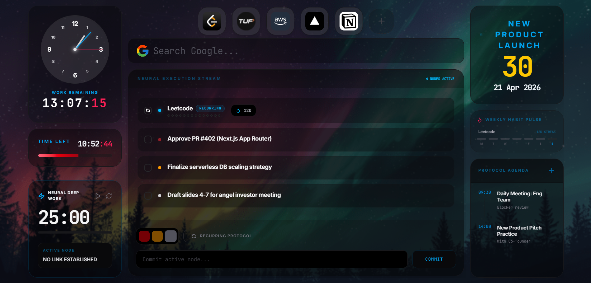
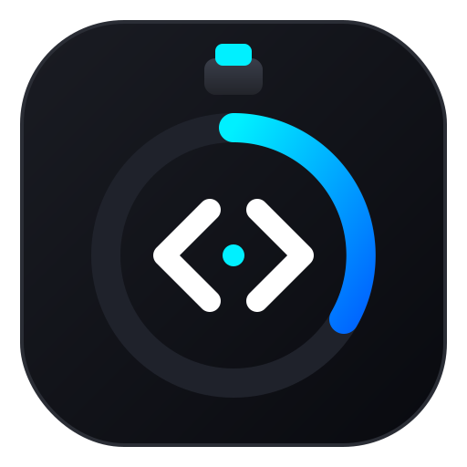

# Focus New Tab (FNT) - Developer Dashboard

> **A high-performance, zero-latency mission control center that replaces your default browser new tab page.**

**Focus New Tab** is a minimalist dashboard engineered for developers, founders, and high-stakes executors. It combines real-time task tracking, habit synchronization, and cognitive scratchpads into a single, portable, privacy-first interface. Designed to eliminate procrastination and keep your immediate priorities front and center.

🔗 **[Live Preview](https://sahilkhan117.github.io/Custom_Focus_New_Tab-Developer_Dashboard/)**



<p align="center">
   
  <br>
  <span style="font-size: 42px; font-weight: bold; color: #61DAFB;">Focus New Tab</span>
</p>
<p align="center">
  
  
  
  
  
</p>

---

## 🚀 Core Features

### ⚡ Priority-Sequenced Task Matrix
Categorize your workflow into **Emergency**, **Warning**, and **Primary** nodes. The UI automatically promotes high-value execution items, ensuring your most critical tasks are impossible to ignore.

### 🏆 Daily Achievement Archive
Completed tasks and habits are automatically moved to the **Completed Protocols** archive. This creates a visual record of your daily wins and allows for easy restoration of tasks if needed.

### 🧠 Neural Scratchpad (Remember)
A flexible, unindexed space for brain dumps and mental notes. Features 3 importance-based text sizes (**S, M, L**) to help you visualize the weight of different thoughts and reminders.

### 🔥 Weekly Habit Pulse
Build long-term consistency with recurring protocols. Track your 7-day performance at a glance with integrated streak tracking and visual consistency markers.

### 🎯 Milestone Countdown
A high-visibility tracker for your most critical project deadlines. Features an editable title and Escalate visual cues as dates approach.

---

## 🛠 Architecture & Tech Stack

This project is built for absolute speed, zero layout shift, and total privacy.

- **Frontend Core**: React 19 + TypeScript.
- **Single-File Distribution**: Vite 6 + `vite-plugin-singlefile`, enabling a completely self-contained `index.html` that works over the `file://` protocol.
- **Styling**: Tailwind CSS 4 with a custom high-contrast, dark-mode design system.
- **Data Model**: 100% LocalStorage. Completely offline, zero external database calls or API dependencies.
- **Runtime**: Bun for ultra-fast development and build cycles.

---

## 📦 Deployment & Setup

### Local Development
1. **Install Dependencies**:
   ```bash
   bun install
   ```
2. **Launch Development Server**:
   ```bash
   bun run dev
   ```
3. **Generate Production Build**:
   ```bash
   bun run build
   ```
   *Note: The production build generates a single, self-contained `dist/index.html` file.*

---

## 🌐 Browser Integration Guide

To set **Focus New Tab** as your custom start page:

#### **For Brave / Chrome / Edge**
1. Build the project using `bun run build`.
2. Install a "Custom New Tab" extension (e.g., [Custom New Tab URL](https://chromewebstore.google.com/detail/custom-new-tab-url/mmcgllhfgdleepmcjfknghochgikelaa)).
3. In the extension settings, point the URL to your local file path:
   `file:///D:/path/to/your/new_tab/dist/index.html`
4. Ensure **"Allow access to file URLs"** is enabled in the extension's browser settings.
